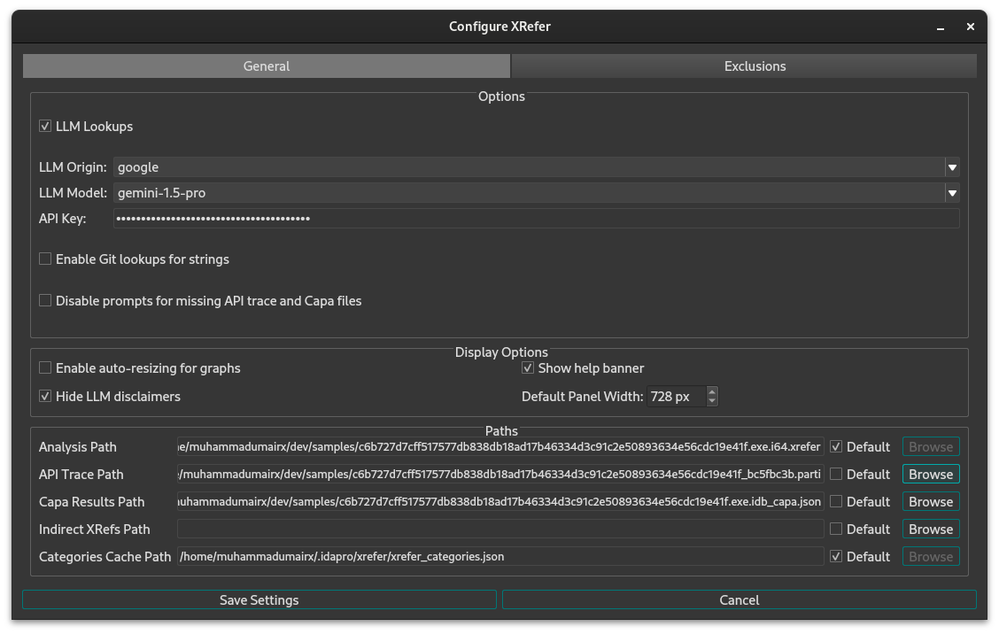
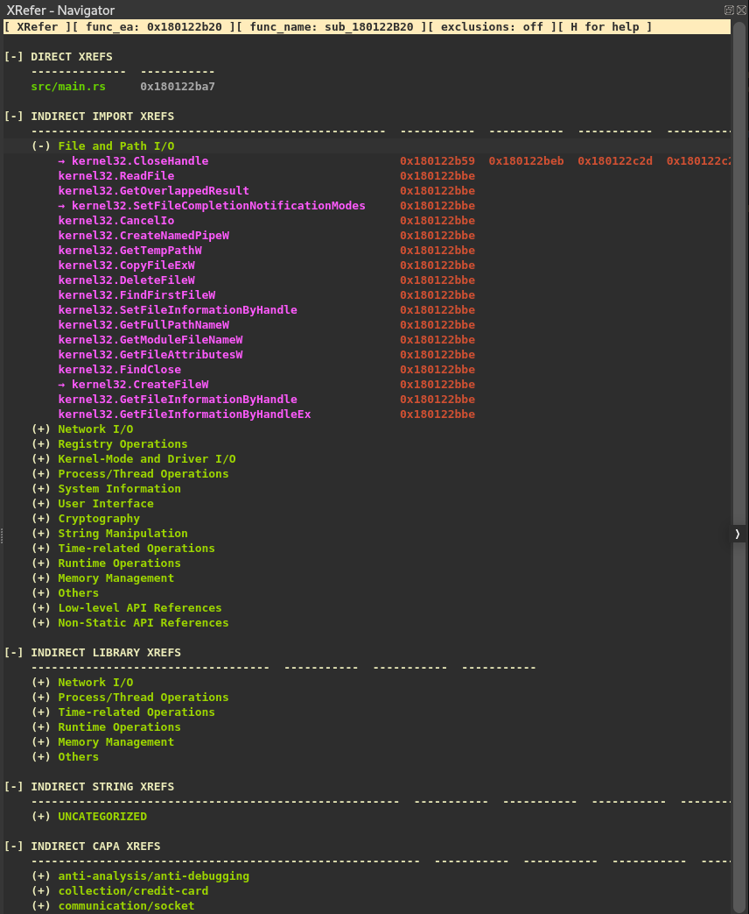
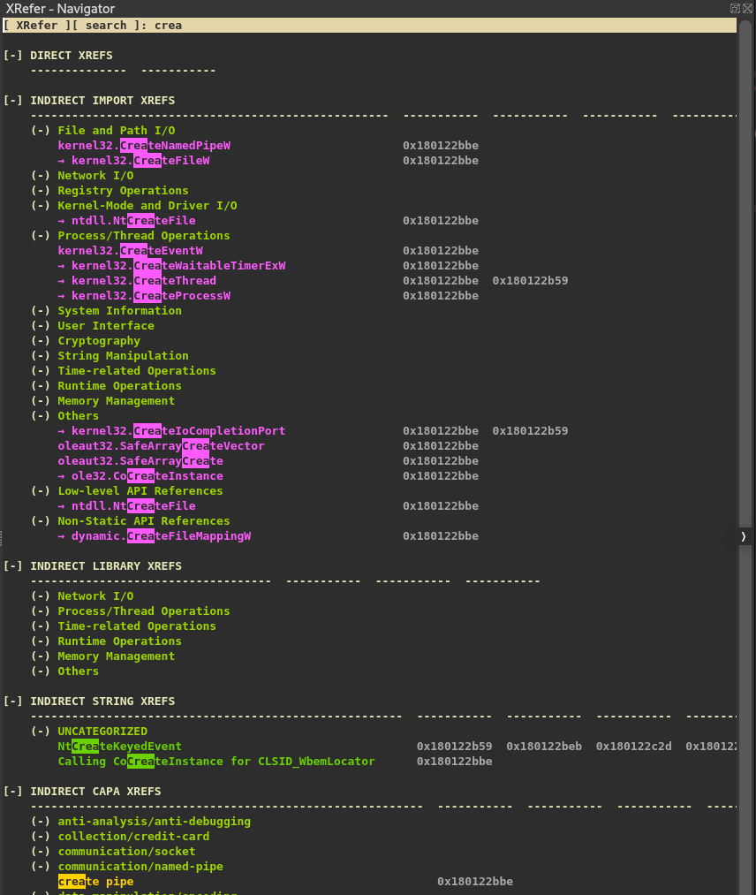
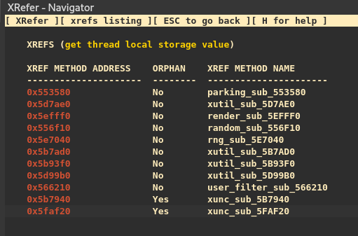
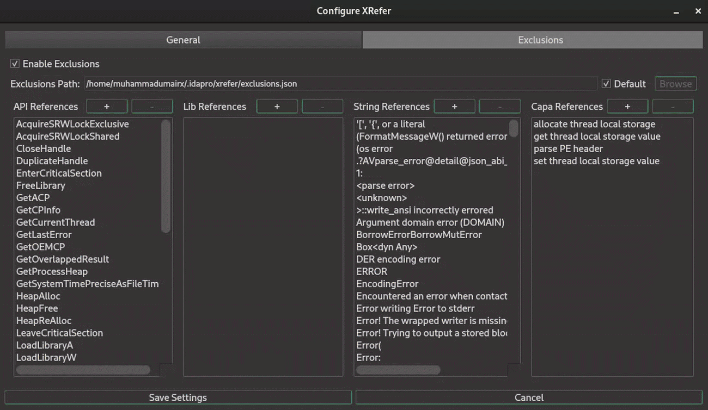
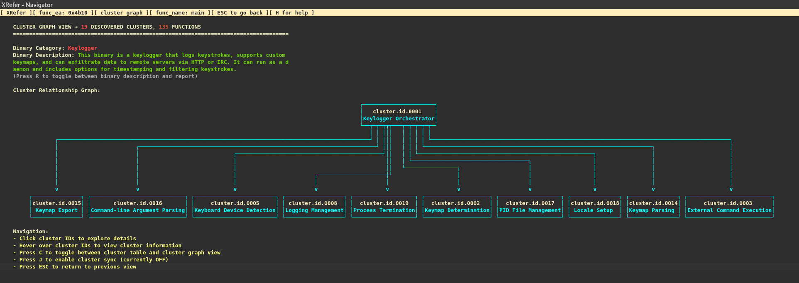
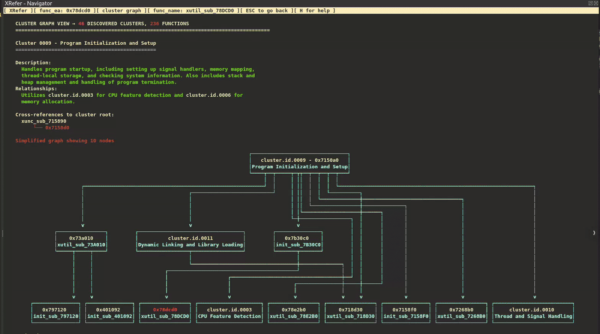
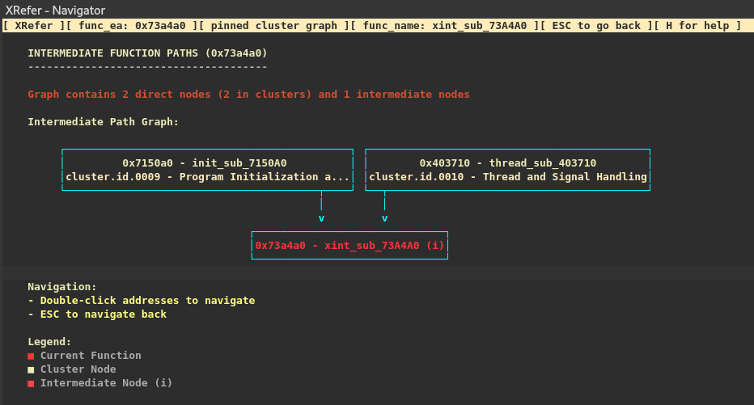

*NOTE: This guide is a work in progress. It does not exhaustively go over all available functionalities and use cases of XRefer. However, this is a good place to start and will continue to be updated.*

## Getting Started

Once the plugin has been installed, loaded and your IDB is open, go to `Edit->XRefer->Configure`.

XRefer will run without any external data sources however depending on the scenario, external data may improve the results. If you are able to provide the results file (JSON) from capa and/or a sandbox trace from either VMRay or CAPE sandbox, that will always be recommended. You can also write and add your own custom trace parser (for example for TTD traces) to XRefer. A bulk of the functionality around clustering will not be available if a Gemini API key is not setup. Currently, XRefer is only allowing and recommending `gemini-1.5-pro` model, however that can and will likely change in the future. After setting up the key and enabling LLM lookups, go to `Edit->XRefer->Run Analysis` and choose between `Default` and `Custom` entry points. For a normal executable the default is the recommended option to go with. For DLLs/libraries however you can choose which export seems the most interesting and go with it.

*Note 1: If you choose the wrong export in a DLL for analysis i.e. a function that barely has any execution paths, the path analysis will be somewhat slower. This is because XRefer conducts a BFS search to establish paths between entrypoints and artifact containing functions. If the function you have selected really does not lead anywhere, XRefer's BFS will try and exhaust all nodes in trying to establish paths between functions where none exist and this will be slower than the path analysis of an actually interesting export.*

*Note 2: When any LLM lookups are performed (Artifact Categorization, Interesting Artifacts Analysis, Cluster Analysis etc), due to the single-threaded nature of IDA Python, IDA will seem to hang. No interaction is required at this point, please wait and let the lookups complete and IDA will be back to normal. A work around for this has yet to be implemented.*

When the LLM lookups are enabled, for convenient browsing XRefer also categorizes the artifacts (strings, libs, capa, APIs and API calls) it extracts e.g. `File and Path I/O`, `Network I/O` etc. This cache is stored locally on the system at `/ida_user_dir/xrefer/xrefer_categories.json` and keeps building up as you analyze more samples. Which means your first few runs are likely going to be your slowest, after which most common artifacts will have their categories already stored locally. 

## Basic Navigation

Once the analysis finishes you will jump to the analyzed entry point of the sample and will be greeted by the `base` view.

Direct cross references here are the direct artifacts of the current function. Whereas indirect cross references show downstream functionality for the current function (if you were to visit all of the nested child functions). At this point you can also enable the help banner from configurations.

#### Dynamic Help Banner

The help banner shows applicable keys/shortcuts depending on the view you're currently in. While this is not perfect (sometimes some shortcuts may not work in some corner cases, or there may be nothing available for example to `dbl-click` over), it's a good place to start and I will improve this dynamic help banner to become more accurate as we go along.

#### Base View

The base/home view is where the context-aware navigation comes in. This view changes based on the current function you're viewing in IDA. When available it will show all artifacts (including libs, strings, capa, APIs and API calls etc) referenced by the current function and it's child functions. Double clicking on the addresses will jump to the actual reference locations of these artifacts within the function. For indirect references, double clicking on these address will instead jump to a function call which eventually leads to this artifact.

Click on `+` icons in the base view to expand/collapse tables and click on arrows `→` before API artifacts to expand their corresponding API calls (if ingested during analysis).

#### Global Search

You can quickly search through all the artifacts in one go by pressing `S` and typing the search term in the base view.

As a rule of thumb, the `ESC` key will always act like a back button and return you to the previous state in your navigation history. In this instance pressing `ESC` will exit the search mode and bring you back to the base view.

#### Path Graphs

You can click on any function artifact and press `G` to draw path graph for that artifact. This graph will visualize all available simple execution paths to that particular artifact. Hovering over function addresses in the graph nodes will display a popup with information about that function. This allows you to quickly peek at what potential behavior each function might contain and thus quickly decide which function deserves deeper investigation for your particular analysis. If the current function you're viewing is in the currently drawn path graph it will be highlighted. You can press `G` again to pin the graph and use this as a quick navigation map to browse to different function within it. You can browse to a function by double clicking on it. Press G again to toggle out of pinned mode. If the graph is not pinned, double clicking and browsing to a function will reset the view to base mode.

#### Cross References

Similarly, pressing `X` on an artifact will show all it's cross references. This is similar to the native `X` functionality within IDA. However, this works for all types of artifacts including ones that are not tracked by IDA .e.g capa results, strings and library references extracted from specialized parsers like Rust and API calls resolved dynamically and loaded through a trace file which would otherwise be missing in IDA.

#### Peek View

XRefer additionally allows to turn on Peek View from the right click context menu. Once enabled, clicking on any function name within the disassembly or pseudocode views will quickly filter the base view to show only artifacts that are part of the downstream functionality of that function i.e. are referenced by one or more of the child functions on it's execution path. Imagine a situation where you have a large function with numerous function calls to various functions that further contain deeper nested function calls. Rather than browsing through each function and then through all of it's nested function calls one by one to figure out if any interesting functionality exists within them, you can just turn on the Peek View and let XRefer quickly filter and display all downstream artifacts directly in the `base` view. This makes for quick identification of interesting functions and function paths, allowing for a quicker decision on which paths and/or functions deserve deeper investigation.

#### Exclusions

To reduce the noise, in the `base` mode you can double click on any artifact, selecting/highlighting it and then press `D` to exclude it from the various views that XRefer provides. More than one artifacts can be selected and excluded this way. 

These exclusions can be managed through `Edit-> Configure -> Exclusions` where wildcards can also be used to add bulk exclusions.

The `U` shortcut can be used to enable/disable exclusions globally.

#### Trace Mode

Pressing `T` from the base view will jump into the trace mode. You can press `T` repeatedly to toggle between the trace mode scopes `function`, `path` and `full` trace. Function scope displays the API calls made directly by the current function. Path scope displays all API calls that occur downstream from the current function, following its execution paths. This helps analysts understand the complete chain of system interactions triggered by a particular function. Finally in the full trace mode, the full trace for the binary is displayed without any type of filters. These APIs are already de-duplicated with the count of each API call being displayed in front of it.

## Cluster Analysis

If an API key was already configured, clustering analysis should already have been performed during the primary analysis. If not or if you want to re-run the analysis you can do so either through the plugin menu or through the right click context menu `Right Click -> XRefer -> (Re-)run Cluster Analysis on all Functions (default)`

In the base view pressing `C` will enter the Cluster Graphs mode where the first thing you will see will be the cluster relationship graph.

Pressing `C` repeatedly will toggle between the cluster graphs and the linear clusters view.

Pressing `R` in both these view will toggle between a brief description of the binary and a slightly detailed report. 

In Cluster Graphs mode clicking on any cluster ID will browse into the corresponding cluster, expanding it. Whereas double clicking on any function inside the cluster will browse to that function. Hovering over cluster IDs will display information popups about those clusters and hovering over function addresses will display popups with function information. Using `G` will pin the cluster graph view so that when you browse to any function the cluster graph view does not exit. Alternatively you can toggle `sync` on/off with IDA disassembly/pseudocode views by pressing `J`. This will make XRefer automatically expand into a cluster, if the currently viewed function is a part of one.

*Note: It is recommended to turn on cluster sync via the G key for exploring functions/clusters along with renaming functions by applying cluster label prefixes via `Edit -> XRefer -> Rename Functions -> Apply cluster analysis prefixes`.*

You can quickly toggle between the Cluster Graph view and Base view by pressing `ENTER` and `C`. `ENTER` always resets the current state and jumps back to the base view, whereas pressing `C` from the base view always jumps into the cluster graph view.

Functions can also be directly renamed through the cluster graph view by pressing `N` on their corresponding function addresses.

When a function is not part of a cluster, no graph will be displayed. When a function is an intermediary node i.e. a node that connects nodes within a cluster or interconnects clusters with each other, you will see a slightly different graph view showing those connections. Intermediate nodes will always have the `(i)` indicator being displayed next to them.

#### Function Labeling

Once the cluster analysis has been performed, you can add prefix labels to function names based on their cluster membership via `Edit -> XRefer -> Rename Functions -> Apply cluster analysis prefixes`. This makes for a more convenient exploration experience. Following describes the prefixing convention currently in use.

| Prefix       | Description                                                                                                            |
| ------------ | ---------------------------------------------------------------------------------------------------------------------- |
| \<cluster\>_ | Single-cluster functions using Gemini-suggested prefixes specific to their cluster's role                              |
| xutil_       | Utility functions that serve multiple clusters (e.g., memory operations, string handling, logging, runtime operations) |
| xint_        | Intermediate nodes that connect functions within or between clusters but aren't strictly part of any cluster           |
| xunc_        | Functions that don't belong to any cluster                                                                             |

#### Fine Tuning Cluster Analysis

You can fine tune cluster analysis by adding exclusions. For example you can potentially exclude `std*`, `core*`, `alloc*` etc library references or memory/heap management APIs and so on. This may reduce the number of the clusters created and thus reduce the LLM analysis time significantly, since queries are performed in batches of 30 clusters each. 

If the goal is to get an overview of the primary functionalities contained within a binary this is a good approach. On the flip side, if the goal is to conduct in-depth analysis using XRefer then I find that not using exclusions can at times help, since as a result more functions are able to get labelled which aids with the browsing experience.

## Miscellaneous

#### Rust Function Renaming

As described in the [blog post](https://cloud.google.com/blog/topics/threat-intelligence/xrefer-gemini-assisted-binary-navigator), XRefer provides very limited but toolchain/version indepedent functionality for renaming a small subset of Rust functions. This functionality can be accessed via `Edit -> XRefer -> Rename Functions -> Rename based on Rust compiler strings`. However, please note that this functionality is non-destructive, which means that it will only rename functions with default `sub_xxxxxxx` names. If a function is already named something other than `sub_xxxxxxx` it will skip renaming that function. That also means, this needs to be run before applying cluster prefixes to function names.

#### Return to Base (home) view
Pressing `ENTER` will always skip all navigation history (unlike `ESC`) and jump back to the `base` view.

#### Expand/Collapse all Table items
While in `base` view, pressing `E` will toggle between expanding and collapsing all items under the current table (based on where the cursor currently is)
